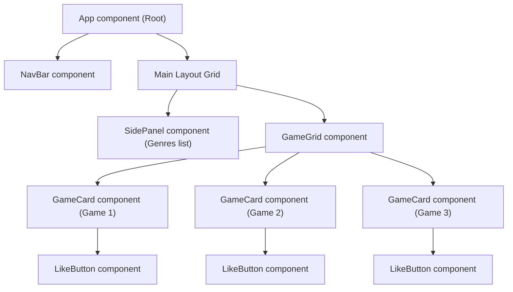

# Introduction To React

> **Source:** [https://www.theodinproject.com/lessons/node-path-react-new-introduction-to-react](https://www.theodinproject.com/lessons/node-path-react-new-introduction-to-react)

---

## Overview

Before we start writing code, let's explore what React actually is, how it functions under the hood, and how it revolutionizes the way modern engineers construct web experiences.

---

## What is React?

**React** is an open-source JavaScript library designed specifically for building dynamic, high-performance, and interactive user interfaces (UIs). 

* **History**: Developed and open-sourced by a software engineer at Facebook in 2011 to handle massive, real-time data feeds (like the Facebook newsfeed and chat systems).
* **Adoption**: Today, React is the single most widely used front-end technology globally. Understanding React is a fundamental requirement for anyone seeking a role as a front-end developer. Leading companies like Facebook, Netflix, Instagram, Airbnb, and Microsoft leverage it extensively.

### The Problem: The Document Object Model (DOM) and Vanilla JS

To understand why React is so revolutionary, let's look at how the browser works:
1. **The DOM Tree**: When a web browser loads an HTML document, it parses the markup and constructs a tree-like memory structure called the **Document Object Model (DOM)**.
2. **Vanilla JavaScript Access**: In plain JavaScript (referred to as **Vanilla JS**), we interact with this tree by manually querying elements, adding event listeners, and updating the markup:
   ```javascript
   // Querying and manual updating in Vanilla JS
   const followButton = document.querySelector("#follow-btn");
   followButton.addEventListener("click", () => {
     followButton.textContent = "Following";
     followButton.classList.add("active");
   });
   ```
3. **The Scaling Bottleneck**: As applications grow to include hundreds of elements, state combinations, database fetches, and complex flows, managing manual DOM queries becomes extremely difficult, bug-prone, and slow.

### The React Solution: Declarative UI & Modular Components

React completely removes the need for manual DOM manipulation. Instead of writing instructions to query and update individual browser elements, you describe how the UI should look based on the current state. React then efficiently creates and updates the underlying browser DOM elements automatically.

#### Reusable Modular Components
React enables you to organize your web interface into small, isolated, self-contained, and reusable blocks of code called **Components**.

Let's look at a real-world example by sketching out the component tree for our **Video Game Discovery Engine (GameHub)**:



* **Independent Modular Blocks**: As shown above, every structural unit on the web page is an independent component.
  * The **LikeButton** is a component nested inside each **GameCard**.
  * Multiple **GameCards** are rendered in a grid list handled by the **GameGrid** component.
  * The **SidePanel** handles category list selections, and the **NavBar** handles high-level searches and themes.
* **Component Tree Architecture**: A React application is essentially a clean tree of interactive components, with a single **App component** acting as the root node to hold everything together.

---

## Assignment

1. **Explore the Ecosystem**: Browse the official [React Homepage](https://react.dev/) to check how they explain interactive state and JSX.
2. **Skim the History**: Check this timeline showing [the development and history of React](https://blog.risingstack.com/the-history-of-react-js-on-a-timeline/).
3. **Understand Libraries vs. Frameworks**: Read this [FreeCodeCamp guide explaining the structural differences between libraries and frameworks](https://www.freecodecamp.org/news/the-difference-between-a-framework-and-a-library-bd133054023f/).

---

## Knowledge Check

* **What is the primary role of React in front-end architecture?** (See [What is React?](#what-is-react))
* **How does declarative state-based UI update simplify work compared to manual DOM querying?** (See [The Problem: The DOM and Vanilla JS](#the-problem-the-document-object-model-dom-and-vanilla-js))
* **Explain how components build a tree layout inside an interactive web page.** (See [Reusable Modular Components](#reusable-modular-components))
